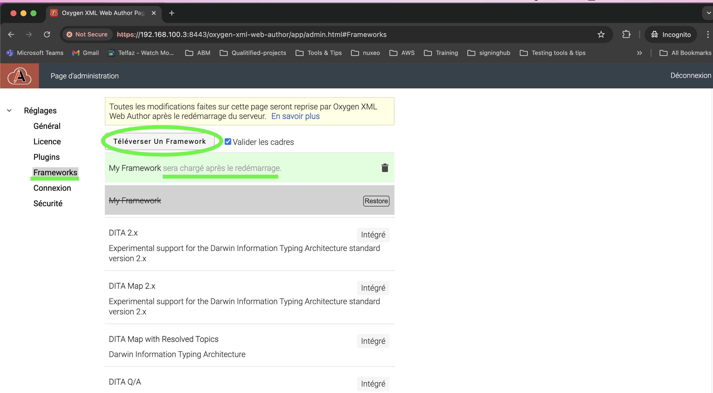

# 🧩 Ajouter un Framework XML personnalisé à Oxygen Web Author

Ce guide décrit les étapes pour créer et intégrer un **framework personnalisé** dans Oxygen Web Author.

---

## 📁 1. Créer la structure du framework

1. Créez un dossier vide, par exemple : `MyFramework`.

2. Créez un fichier `EXF` (par exemple : `my-framework.exf`) avec le contenu suivant :

```xml
<?xml version="1.0" encoding="UTF-8"?>
<script xmlns="http://www.oxygenxml.com/ns/framework/extend"
    xmlns:xsi="http://www.w3.org/2001/XMLSchema-instance"
    xsi:schemaLocation="http://www.oxygenxml.com/ns/framework/extend 
    http://www.oxygenxml.com/ns/framework/extend/frameworkExtensionScript.xsd">
  <name>My Framework</name>
  <description/>
  <priority>High</priority>

  <associationRules>
    <addRule    namespace="*" 
                rootElementLocalName="*" 
                fileName="*" publicID="*" javaRuleClass=""
                attributeLocalName="*" attributeNamespace="*" 
                attributeValue="*"/>
  </associationRules>

  <documentTemplates>
    <addEntry path="${frameworkDir}/templates"/>
  </documentTemplates>

  <classpath>
    <addEntry path="${framework}/resources"/>
  </classpath>

  <xmlCatalogs>
    <addEntry path="${framework}/catalog.xml"/>
  </xmlCatalogs>

  <author>
    <css>
      <addCss path="${framework}/css/main.css"/>
    </css>
  </author>
</script>
```

> 💡 Vous pouvez modifier la règle d'association pour cibler >uniquement certains documents XML spécifiques.
>
>Exemple:
```xml
<associationRules>
    <addRule namespace="[target-name-space]" 
            rootElementLocalName="DOCUMENT" 
            fileName="*" publicID="*" javaRuleClass=""
            attributeLocalName="*" attributeNamespace="*"           
            attributeValue="*"/>
  </associationRules>

```

---

## 📄 2. Créer un modèle de document

- Créez un dossier `templates/`.
- Ajoutez des fichiers XML modèle représentant la structure minimale de vos documents.

---

## 📚 3. Ajouter des schémas

1. Créez un dossier `schemas/` et placez-y vos fichiers `.xsd`.

2. Créez un fichier `catalog.xml` à la racine du framework :

```xml
<catalog xmlns="urn:oasis:names:tc:entity:xmlns:xml:catalog">
  
  <uriSuffix uriSuffix="[schema-file-name].xsd"     
             uri="./schemas/[schema-file-name].xsd"/>

  <uri name="[target-name-space]" uri="./schemas/[schema-file-name].xsd"/>
</catalog>
```

> Remplacez `[schema-file-name]` `[target-name-space]` par le nom de votre fichier XSD et votre namespace.

---

## 🎨 4. Personnaliser l'affichage avec CSS

1. Créez un fichier `css/main.css`.

2. Exemple de contenu pour commencer :

```css
* {
  display: block;
}

/** Affiche le nom de chaque élément (utile pour le développement) */
*:before(1001) {
  content: oxy_name() " ";
  font-size: 0.75rem;
  font-family: monospace;
  background-color: lightgray;
}
```

---

## 🧪 5. Tester votre framework

1. Créez une archive ZIP du dossier `MyFramework`.

2. Dans la page d’administration de Web Author, téléversez ce ZIP.


3. Redémarrer oxygen-web-author 
    ```
    docker restart oxygen-webauthor-container
    ```

4. Créez un nouveau fichier à partir du modèle défini et ouvrez-le.

> 🗂️ Le framework est copié dans : **/usr/local/tomcat/work/Catalina/localhost/oxygen-xml-web-author/user-frameworks**


5. Vous pouvez modifier les fichiers CSS dans ce dossier pour ajuster le rendu et rafraîchir le navigateur.

> 🗂️ Voir l'exemple [📄 My Note Framework](./MyNoteFramework) 


---
## 📂 Ajouter une Toolbar Personnalisée dans Oxygen Web Author pour un Framework Custom

Ce guide explique comment configurer une barre d’outils avec des actions personnalisées, comme appliquer du **gras** avec une balise `<B>`, dans un framework personnalisé pour **Oxygen Web Author**.

➡️ Voir la page dédiée : [📄 Add-custom-toolbar](Oxygen_Toolbar_Tutorial.md)

---

🎉 Votre framework personnalisé est maintenant prêt à être utilisé dans Oxygen Web Author !

