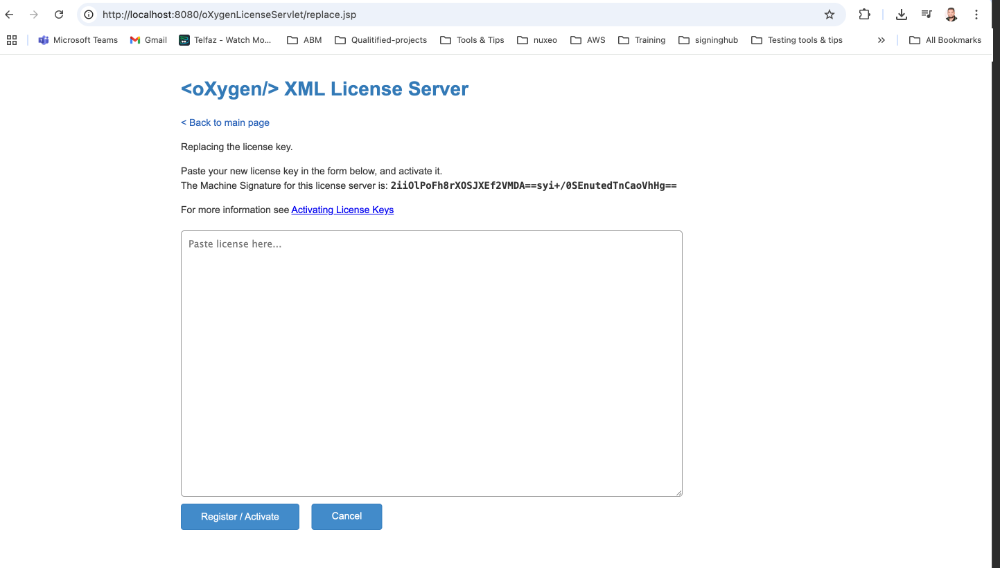
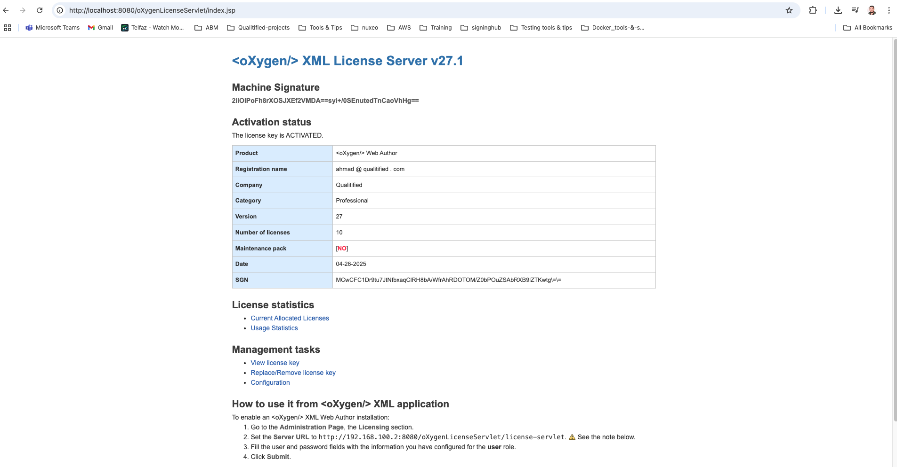
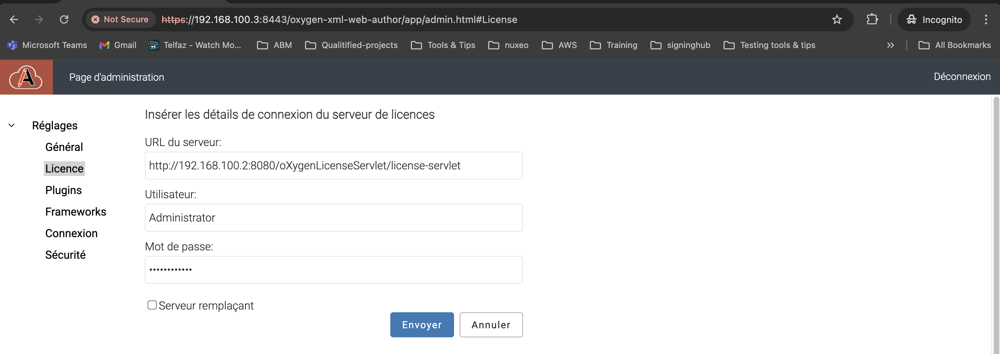
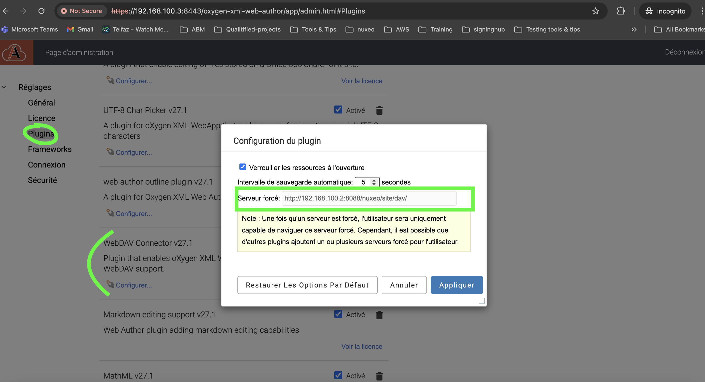

# 🚀 Tutoriel : Déploiement et Intégration de Oxygen Web Author avec Nuxeo

Ce guide vous accompagne pas à pas pour :
- Déployer **Oxygen XML Web Author** avec Docker,
- Installer et configurer le serveur de licence HTTP,
- Intégrer Web Author avec **Nuxeo via WebDAV**,
- Personnaliser l’authentification (POC),
- Ajouter un framework XML personnalisé.

---

## 🐳 Déploiement de Oxygen Web Author via Docker

1. **Construire l’image Docker** :

```bash
docker build -t web-author-base .
```

2. **Créer un volume Docker pour la persistance des données** :

```bash
docker volume create web-author-data
```

3. **Lancer le conteneur Web Author** :

```bash
docker run --name oxygen-webauthor-container -p 8443:8443 --mount source=web-author-data,target=/usr/local/tomcat/work/Catalina/localhost/oxygen-xml-web-author web-author-base
```

> ⚠️ Oxygen Web Author doit impérativement être exécuté en **HTTPS**.

4. **Configurer l'option `SameSite`** pour permettre l'intégration dans une iframe (ex. Nuxeo) :

Dans le fichier :
```
oxygen-webauthor-container:/usr/local/tomcat/work/Catalina/localhost/oxygen-xml-web-author/options/options.xml
```

Ajouter :

```xml
<entry>
  <String>force.cookies.samesite.none</String>
  <Boolean>true</Boolean>
</entry>
```

📎 **Référence** : [oxygenxml/web-author-docker GitHub](https://github.com/oxygenxml/web-author-docker/tree/master)

---

## 🔐 Installation du Serveur de Licence HTTP

### Prérequis

- Java 8 ou plus récent installé.

### Étapes

1. Télécharger l'archive :
[https://www.oxygenxml.com/InstData/LicenseServlet/oXygenHTTPLicenseServer.zip](https://www.oxygenxml.com/InstData/LicenseServlet/oXygenHTTPLicenseServer.zip)

2. Décompresser l’archive.

3. Lancer le script adapté :
   - **Windows** : `licenseServer.bat`
   - **Linux/macOS** : `licenseServer.sh`

### Ajouter une licence

1. Obtenir une licence sur :  
[https://www.oxygenxml.com/xml_web_author/register.html?p=web_author](https://www.oxygenxml.com/xml_web_author/register.html?p=web_author)

2. Ajouter cette licence dans le **license server** via l’interface.




---

## 🔧 Configurer la Licence dans Web Author

Dans l’interface d’administration de Web Author, renseigner l’adresse du serveur de licence.



---

## 🔗 Intégration de Web Author avec le serveur WebDAV (Nuxeo)

Le plugin **WebDAV Connector** permet d’éditer les fichiers distants stockés sur un serveur WebDAV (ex. Nuxeo).

### Configuration du plugin Webdav

1. Accéder à la page d’administration de Web Author.
2. Aller dans **Plugins**.
3. Cliquer sur le bouton de configuration à côté de **WebDAV Connector**.

#### Options disponibles

- **Lock resources on open** : active/désactive le verrouillage automatique.
- **Autosave interval** : intervalle (en secondes) pour l’enregistrement automatique.
- **Enforced server** : fixe l’URL du serveur WebDAV (ex: `https://nuxeo.example.com/nuxeo/site/dav/`).



---

## 🧪 Personnalisation de l’authentification (à des fins de test)

> ❗ **Attention : solution non sécurisée, uniquement pour des tests**

Pour simuler une **connexion automatique à webdav server**, il est possible de modifier le fichier **plugin.js** du plugin WebDAV afin d’intégrer des **données d’authentification statiques**.

Le fichier plugin.js fourni dans ce dépôt a été modifié pour effectuer une **authentification automatique** vers le serveur WebDAV (nuxeo) en utilisant les identifiants : `Login : Administrator ,Password : Administrator`. Afin de l'utiliser, il faut exécuter la commande suivant :
```bash
docker cp plugin.js oxygen-webauthor-container:/usr/local/tomcat/work/Catalina/localhost/oxygen-xml-web-author/plugins/web-author-webdav-plugin-27.1/web/plugin.js
```

> ⚠️ Attention : cette approche est destinée uniquement à des fins de démonstration ou de Proof of Concept (POC). Elle ne doit pas être utilisée en production, car elle introduit de sérieux risques de sécurité.

### 📦 Bonnes pratiques : Chargement du JavaScript côté client

Si un plugin nécessite du code JavaScript à exécuter côté client, celui-ci peut être placé dans le **dossier web du plugin**.

- Le Web Author charge automatiquement tous les fichiers .js situés dans le dossier web du plugin.

- Les fichiers sont chargés dans l’ordre lexicographique (par exemple : abc10.js sera chargé avant abc2.js).

Cela permet d’ajouter facilement des comportements personnalisés à l’interface sans modifier le cœur de l'application.

---

## 📂 Ajouter un Framework XML personnalisé

Vous pouvez ajouter un framework XML propre à votre projet.

➡️ Voir la page dédiée : [📄 Add-custom-framework](Add-custom-framework.md)

---

