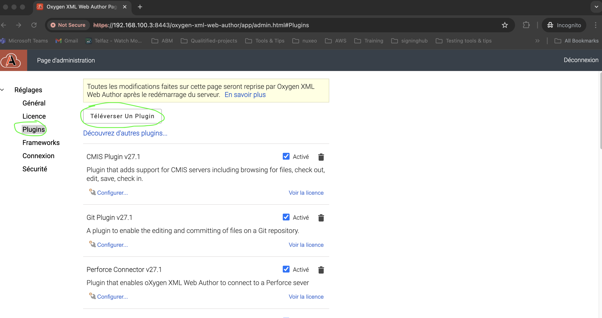

# 🎨 Plugin Oxygen : Insertion de balise `<color>`

Ce plugin ajoute un **bouton dans la barre d’outils d’Oxygen XML Editor**. Ce bouton ouvre une **palette de couleurs**. En cliquant sur une couleur, une balise `<color>` sera insérée autour du texte sélectionné (ou à la position du curseur) avec un attribut `value` contenant le code hexadécimal de la couleur.

Exemple d'insertion :

```xml
<color value="#ff0000">Texte en rouge</color>
```

## ✅ Fonctionnalités

- Ajoute une action personnalisée dans la toolbar Oxygen.
- Affiche une palette de 4 colonnes avec différentes couleurs.
- Insère une balise `<color>` avec un attribut `value`.
- Possibilité d’annuler la palette sans sélection.

## ⚙️ Installation

1. Compresser le dossier `insert-color-tag`.

2. Uploader le plugin le menu plugin de la page d'administration


3. Redémarrer Oxygen.

## ⚠️ Prérequis

1- Votre schéma XML (XSD) doit définir l’élément <color> ainsi que son attribut value.
```xml
<xs:element name="color">
  <xs:complexType mixed="true">
    <xs:attribute name="value" type="xs:string" use="required"/>
  </xs:complexType>
</xs:element>
```
2- Pour que la balise <color> soit rendue visuellement dans Oxygen, ajoutez cette règle CSS dans votre framework :

```css
color {
  color: attr(value);
}
```

Assurez-vous que le namespace correspond à celui utilisé dans vos documents (`http://www.groupeXY.com`, par exemple).
